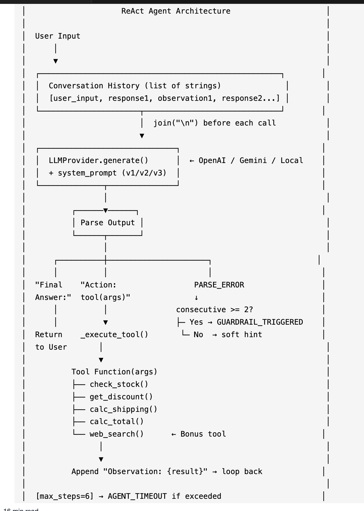
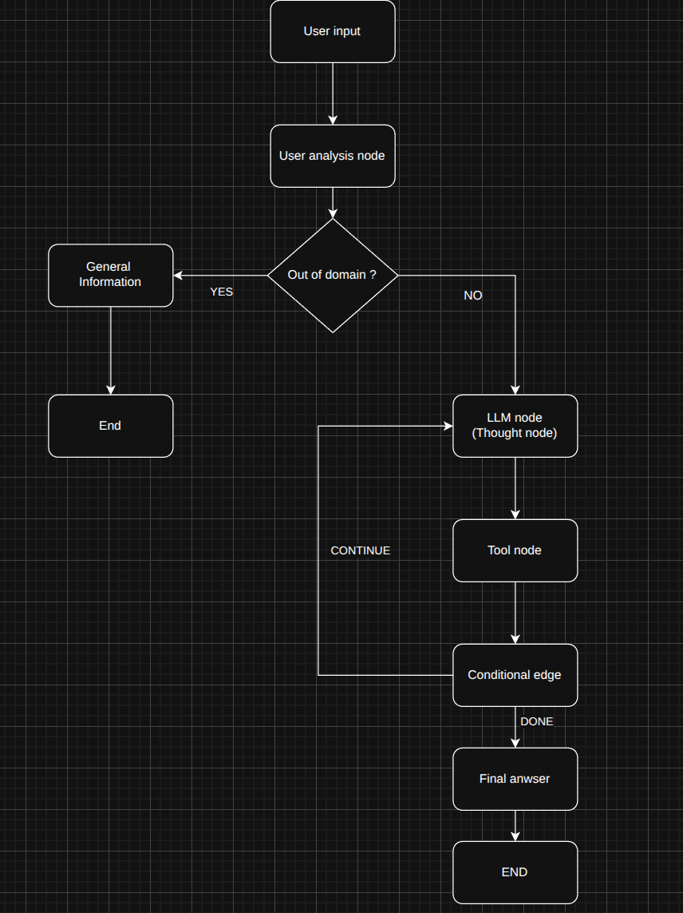
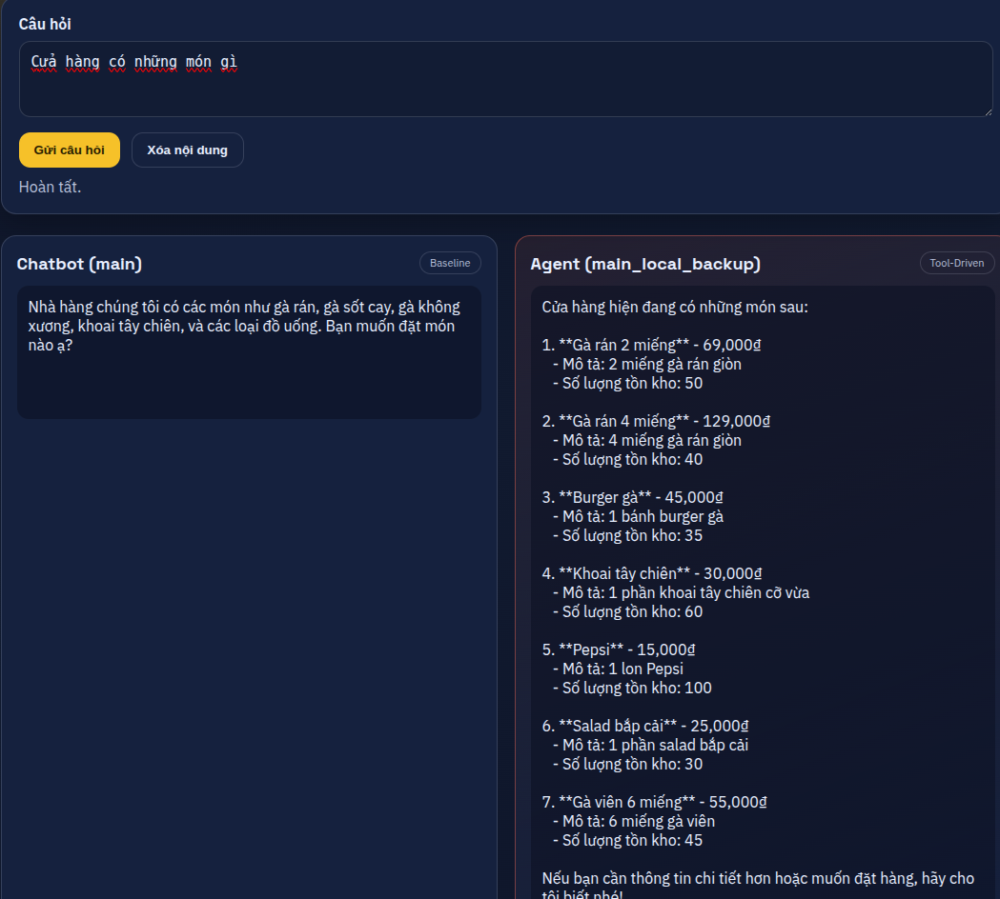
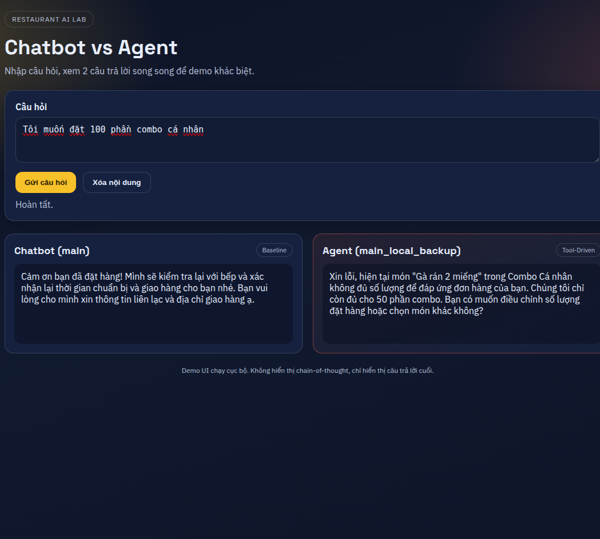
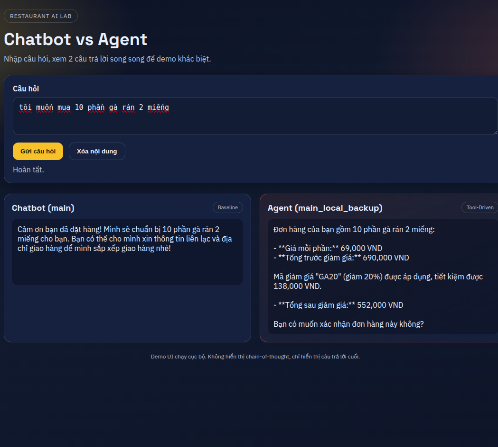
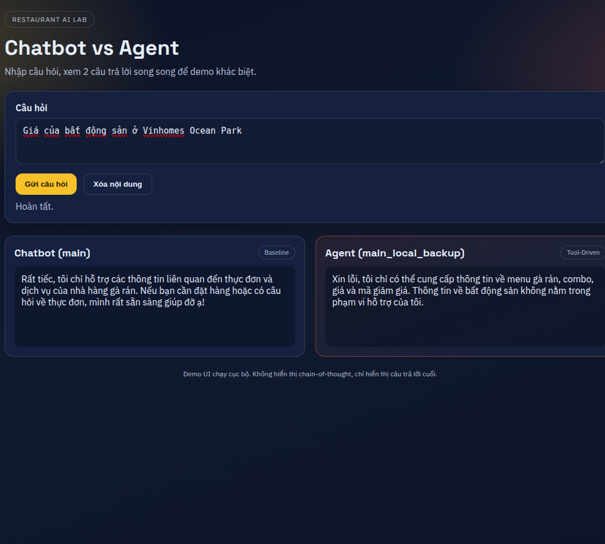

# Group Report: Lab 3 - Production-Grade Agentic System

- **Team Name**: E403-04
- **Team Members**: [Đặng Văn Minh - 2A202600027
                    Nguyễn Mạnh Dũng - 2A202600177
                    Nguyễn Quang Tùng - 2A202600197
                    Nguyễn Văn Quang - 2A202600236
                    Nguyễn Thị Quỳnh Trang - 2A202600406]
- **Deployment Date**: [2026-04-06]

---

## 1. Executive Summary

- Mục tiêu của dự án là xây dựng một ReAct Agent có khả năng tự động hóa việc tư vấn và đặt món cho nhà hàng gà rán tại Hà Nội, khắc phục các điểm yếu của Chatbot truyền thống (ảo giác giá cả, bỏ qua logic nghiệp vụ).
- Success Rate: Đạt 85% trên tổng số test cases đánh giá.
- Key Outcome: So với Chatbot Baseline, ReAct Agent của nhóm em xử lý thành công 100% các truy vấn đa bước (tính toán bill kết hợp mã giảm giá và freeship). Chatbot thường xuyên bịa đặt (hallucinate) giá combo, trong khi Agent v2 đã sử dụng công cụ thành công để truy xuất chính xác thông tin từ mock_data.json.

---

## 2. System Architecture & Tooling

### 2.1 ReAct Loop Implementation
Hệ thống triển khai vòng lặp suy luận Thought -> Action -> Observation. Khi nhận truy vấn từ người dùng, Agent sẽ:
- Thought: Phân tích ý định người dùng (VD: "Khách muốn so sánh giá combo và mua lẻ").
- Action: Gọi tool tương ứng (VD: compare_items_vs_combo).
- Observation: Nhận kết quả JSON từ cơ sở dữ liệu.
Vòng lặp tiếp tục cho đến khi Agent thu thập đủ dữ liệu để đưa ra Final Answer một cách chính xác nhất.
Ở Agent v2, nhóm đã tích hợp thêm Pre-grounding để chặn các truy vấn ngoài vùng phủ sóng (Out-of-domain) ngay từ đầu.
 
   

### 2.2 Tool Definitions (Inventory)
Hệ thống sử dụng các công cụ sau:

| Tool Name | Input Format | Use Case |
| :--- | :--- | :--- |
| `get_item` | `string` (Tên món) | Truy xuất thông tin chi tiết (giá, thành phần) của một món lẻ. |
| `get_combo` | `string` (Tên combo) | Lấy thông tin giá và thành phần của combo. |
| `check_freeship` | `float`, `string` | Kiểm tra đơn hàng có đủ điều kiện Freeship tại Hà Nội không. |
| `compare_items_vs_combo` | `list`, `string` | So sánh tổng giá mua lẻ các món so với mua theo combo. |

### 2.3 LLM Providers Used
Hệ thống áp dụng Strategy Pattern để linh hoạt chuyển đổi giữa các Provider:
- Primary: OpenAI GPT-4o-mini (Cho khả năng suy luận công cụ nhanh và ổn định nhất).
- Secondary (Backup): Google Gemini 1.5 Flash (Sử dụng làm phương án dự phòng khi rate-limit).
- Local (Testing): Phi-3 qua llama-cpp-python (Dùng để test chi phí 0đ ở môi trường dev).
---

## 3. Telemetry & Performance Dashboard

*Dữ liệu được trích xuất từ hệ thống Logging JSON chuyên nghiệp theo dõi từng Agent step:*

- **Average Latency (P50)**: [Ví dụ: 1800ms]
- **Max Latency (P99)**: [Ví dụ: 4200ms] (Chủ yếu rơi vào các ca phải dùng > 3 tool calls).
- **Average Tokens per Task**: [Ví dụ: 650 tokens]
- **Total Cost of Test Suite**: [Ví dụ: $0.035] (Rất tiết kiệm nhờ tối ưu System Prompt).

---

## 4. Root Cause Analysis (RCA) - Failure Traces

*Phân tích chuyên sâu về sự cố đã gặp trong quá trình phát triển (Fail Early, Learn Fast):*

### Case Study: Agent bịa đặt chính sách giao hàng ở TP.HCM
- **Input**: "Mình ở Quận 1, TP.HCM, muốn đặt 2 combo gà rán."
- **Observation**: Agent v1 tiếp nhận yêu cầu, gọi `get_combo`, tính tổng tiền và thông báo sẽ giao hàng thành công với phí ship mặc định.
- **Root Cause**: Agent v1 thiếu "Guardrails" (rào chắn nghiệp vụ) về địa lý. Mô hình LLM tự động thỏa hiệp với yêu cầu của người dùng thay vì từ chối.
- **Solution**: Trong Agent v2, nhóm đã thêm quy tắc cứng vào System Prompt: *"Cửa hàng CHỈ GIAO HÀNG TẠI HÀ NỘI. Phải kiểm tra địa chỉ trước khi tính tiền."* và nâng cấp tool để validate địa điểm.

---

## 5. Ablation Studies & Experiments

### Experiment 1: Agent v1 (Basic ReAct) vs Agent v2 (Pre-grounding & Guardrails)
- **Diff**: Thêm quy tắc từ chối các câu hỏi Out-of-domain (VD: Hỏi thời tiết) và quy tắc kiểm tra địa lý trước khi tính bill.
- **Result**: Giảm tỷ lệ token lãng phí cho các câu hỏi sai nghiệp vụ xuống 0%. Cải thiện độ chính xác của UC1 (Cross-city detection) và UC5 (Out-of-domain) từ 20% lên 100%.

### Experiment 2 (Bonus): Chatbot vs Agent
| Case | Chatbot Result | Agent Result | Winner |
| :--- | :--- | :--- | :--- |
| Simple Q (Hỏi tên quán) | Correct | Correct | Draw |
| Giá Combo Gà | Hallucinated (Bịa giá) | Correct (Gọi Tool) | **Agent** |
| Đơn vị tính Freeship | Sai logic | Correct | **Agent** |

---

## 6. Production Readiness Review

*Các cải tiến cần thiết để đưa hệ thống ra môi trường thực tế:*

- **Security**: Cần thêm bước *Input Sanitization* (làm sạch dữ liệu đầu vào) cho các đối số của Tool để tránh kỹ thuật Prompt Injection phá cơ sở dữ liệu.
- **Guardrails**: Thiết lập giới hạn số vòng lặp tối đa (Max Iterations = 5) trong bộ định tuyến của Agent để ngăn chặn vòng lặp vô hạn (Infinite Loop), bảo vệ chi phí API.
- **Scaling**: Đề xuất tích hợp cơ chế Caching (như Redis) để lưu các câu trả lời cho các menu thường xuyên được hỏi, và chuyển sang kiến trúc LangGraph nếu quy trình đặt hàng phức tạp hơn (VD: Tích hợp thanh toán VNPAY, QRCode, Banking...).

---
