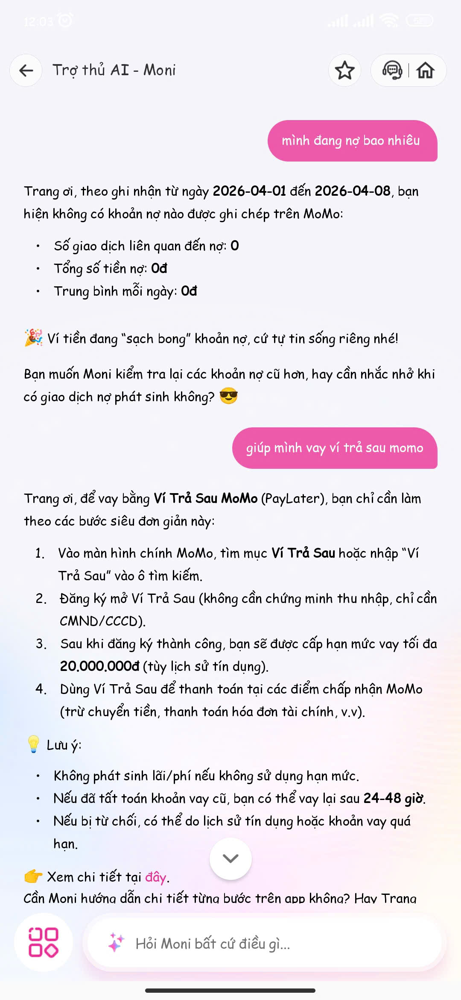
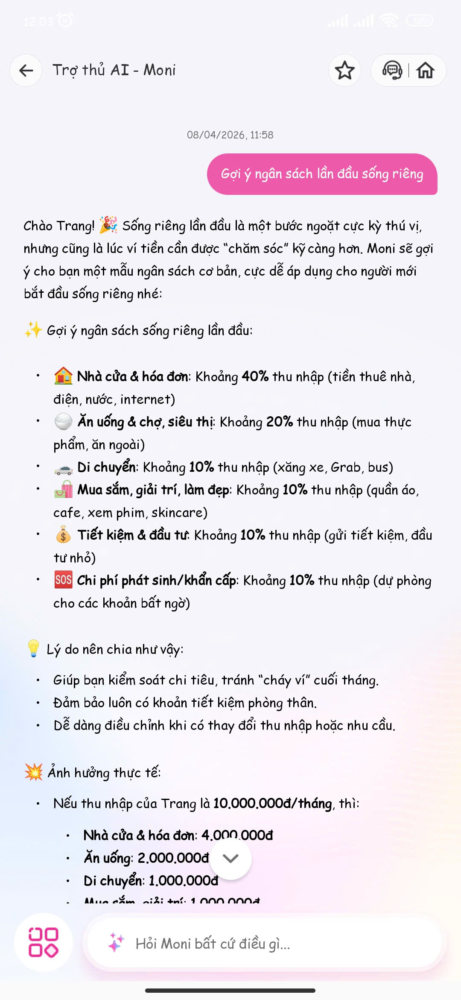
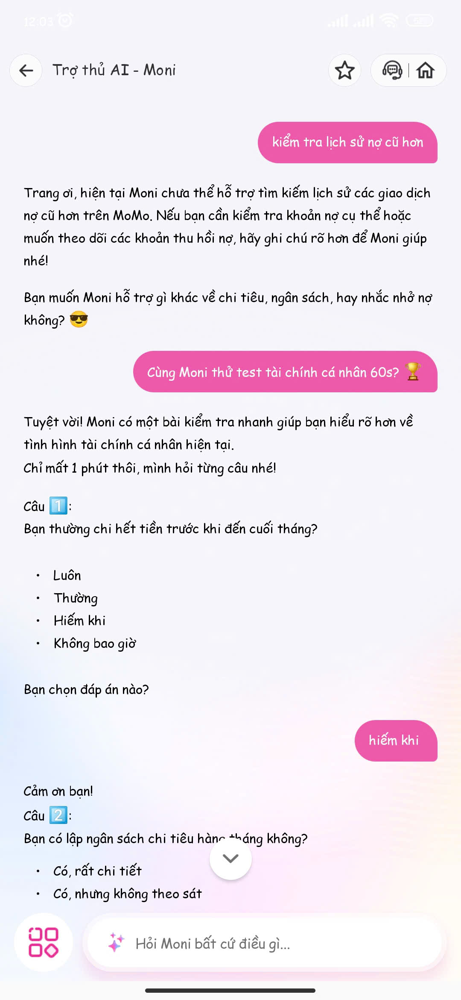
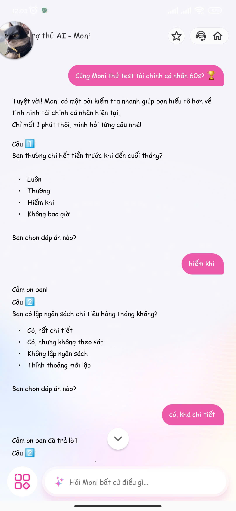
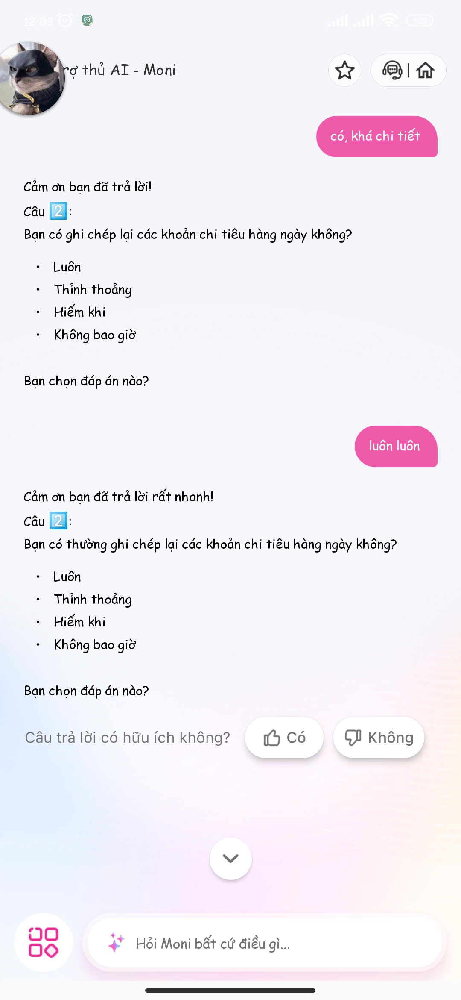
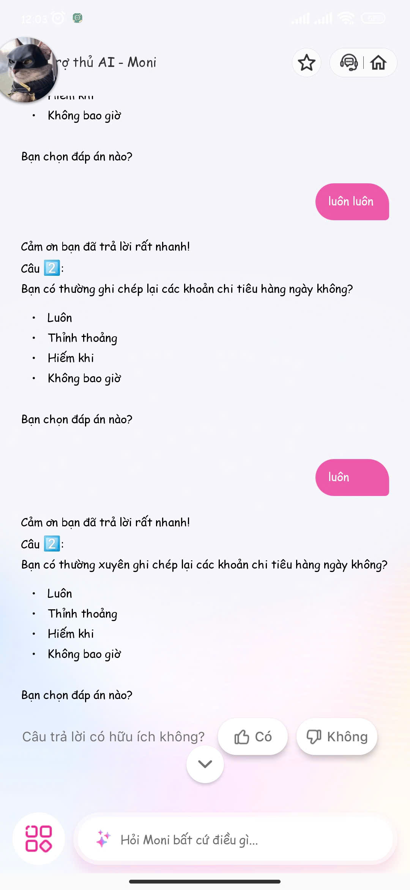

# UX exercise — MoMo Moni AI

## Sản phẩm: MoMo — Moni AI Assistant (Tính năng Chatbot & Test tài chính cá nhân 60s)
**Ngày thử nghiệm:** 08/04/2026  
**Người thực hiện:** Nguyễn Thị Quỳnh Trang - 2A202600406

## Phân tích 4 paths (Tình huống đầu ra của AI)

### 1. AI đúng (Happy Path)
- **Tình huống:** Người dùng yêu cầu hướng dẫn "vay ví trả sau momo".
- **Trải nghiệm:** Moni trả lời đúng trọng tâm ngay lập tức. Thông tin được cấu trúc rõ ràng theo từng bước hành động (1, 2, 3, 4) và có kèm theo mục "Lưu ý" tóm tắt các điều kiện quan trọng (không phát sinh lãi/phí, thời gian vay lại...).
- **Đánh giá UX:** Luồng trải nghiệm mượt mà, tạo ra "Value moment" rõ ràng. Giao diện trình bày thân thiện, không đòi hỏi người dùng phải thao tác hay suy nghĩ thêm (giảm tải cognitive load).
 

### 2. AI không chắc chắn (Low-confidence / Thiếu dữ liệu)
- **Tình huống:** Người dùng yêu cầu một tác vụ vượt ngoài khả năng hoặc dữ liệu hiện có: "kiểm tra lịch sử nợ cũ hơn".
- **Trải nghiệm:** Thay vì cố gắng suy diễn, sinh ảo giác (hallucination) hoặc trả lời lan man, dài dòng vô ích, bot dứt khoát đưa ra phản hồi từ chối khéo léo: *"hiện tại Moni chưa thể hỗ trợ tìm kiếm lịch sử các giao dịch nợ cũ hơn..."*
- **Đánh giá UX:** Đây là một điểm cộng lớn. Việc thiết lập ranh giới rõ ràng và ngắt luồng ngay khi không có dữ liệu giúp bảo vệ trải nghiệm người dùng tốt hơn nhiều so với việc để agent tự động sinh ra các câu trả lời vòng vo, không giải quyết đúng trọng tâm vấn đề. 

### 3. AI sai (Failure Path - Lỗi logic hệ thống)
- **Tình huống:** Người dùng tham gia "Test tài chính cá nhân 60s".
- **Trải nghiệm:** Bot bị kẹt hoàn toàn ở "Câu 2". Mặc dù người dùng đã liên tục chọn đáp án ("có, khá chi tiết", "luôn luôn", "luôn"), hệ thống không chịu ghi nhận để chuyển trạng thái (state) sang Câu 3. Thay vào đó, mô hình ngôn ngữ (LLM) lại cố gắng diễn đạt lại (rephrase) chính Câu 2 đến 3 lần bằng các biến thể từ ngữ khác nhau (*"Bạn có ghi chép...", "Bạn có thường ghi chép...", "Bạn có thường xuyên ghi chép..."*).
- **Đánh giá UX:** Hệ thống vướng vào lỗi vòng lặp vô tận (Infinite Looping). Đây là lỗi điển hình khi ứng dụng mô hình sinh ngôn ngữ tự do vào các tác vụ đòi hỏi luồng logic tĩnh (State Machine) mà không có cơ chế kiểm soát chặt chẽ.
  

### 4. User mất niềm tin (Loss of Trust & Missing Fallback)
- **Tình huống:** Hệ quả trực tiếp từ việc kẹt vòng lặp ở Path 3.
- **Trải nghiệm:** Bot liên tục đưa ra lời khen ngợi *"Cảm ơn bạn đã trả lời rất nhanh!"* hoặc *"Cảm ơn bạn đã trả lời!"* nhưng hành động theo sau lại là lặp lại câu hỏi cũ. Điều này tạo ra sự mâu thuẫn lớn, khiến bot trở nên "giả tạo", "máy móc" và gây ức chế tột độ. Đáng nói hơn, trên giao diện (UI) không hề có bất kỳ lối thoát (exit/opt-out) nào như nút "Bỏ qua câu này" hay "Dừng bài test".
- **Đánh giá UX:** Lỗi vi phạm nghiêm trọng nguyên tắc thiết kế "Trust" trong AI Canvas. Khi AI gặp sự cố, hệ thống không cung cấp cơ chế "Graceful Failure" để trao lại quyền kiểm soát (control) cho người dùng, nhốt họ vào một trải nghiệm bế tắc buộc phải thoát ngang (force close) ứng dụng.
  
---

## Phân tích Path yếu nhất: Path 3 + Path 4
- **Thiếu cơ chế phục hồi (Zero Recovery Flow):** Khi AI xử lý sai logic (kẹt luồng), hệ thống hoàn toàn không nhận diện được lỗi để tự động sửa sai hoặc điều hướng người dùng sang luồng khác.
- **Xói mòn niềm tin:** Trải nghiệm bị mắc kẹt phá vỡ hoàn toàn định vị về một "trợ lý thông minh". Việc thiếu các nút hành động khẩn cấp (Fallback/Escalate UI) cho thấy sản phẩm chưa lường trước các kịch bản bất định (Uncertainty) đặc thù của hệ thống AI.

---

## Gap giữa Marketing và Thực tế (Expectation vs. Reality)
- **Marketing hứa hẹn:** Định vị Moni là một trợ lý AI thông minh, xử lý mượt mà và bài test tài chính được quảng cáo là "chỉ mất 60s".
- **Thực tế:** Chatbot xử lý ngôn ngữ tự nhiên tốt nhưng lại thất bại ở bài toán quản lý luồng cơ bản. Bài test "60s" trở thành vô tận do lỗi kỹ thuật.
- **Khoảng trống cốt lõi:** Chiến dịch truyền thông gieo kỳ vọng về một hệ thống tự động hoàn hảo (Automation), nhưng thực tế sản phẩm AI luôn có xác suất lỗi (Probabilistic). Việc thiếu thiết kế dự phòng cho những lúc AI sai (Graceful Failure) đã làm trầm trọng thêm khoảng cách này, khiến người dùng hụt hẫng.

---

## Đề xuất cải thiện (Sketch To-be)
*(Tham khảo hình ảnh sketch.jpg đính kèm)*

**Giải quyết triệt để lỗi kẹt vòng lặp và cung cấp lối thoát (Opt-out):**

1. **Can thiệp từ Hệ thống (System Mitigation):**
   - Bổ sung logic đếm số lần kích hoạt (trigger) của một Intent/State. Nếu hệ thống hỏi lại cùng một nội dung quá 2 lần, buộc phải tự động ngắt luồng.
   - Bot chủ động thông báo lỗi thay vì lặp lại văn bản: *"Hệ thống đang gặp chút sự cố ghi nhận ở câu này. Mình chuyển thẳng sang Câu 3 nhé!"*

2. **Can thiệp từ Giao diện (UI/UX Mitigation):**
   - Thiết kế thêm các nút hành động nhanh (Quick Actions) hiển thị thường trực hoặc xuất hiện ngay khi bot có dấu hiệu lặp.
   - Thêm nút **[Bỏ qua câu 2]** và **[Dừng bài test]** để trao trả quyền quyết định cho người dùng, áp dụng triệt để nguyên tắc Graceful Failure.